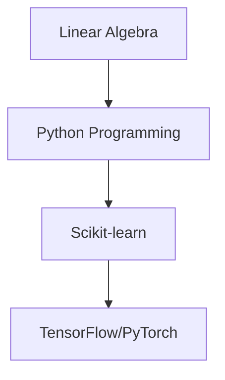

## What is Machine Learning?
Machine learning is the core field of AI that enables computers to automatically learn patterns from data and make predictions.

### Key Concepts
- **Training Data**: The raw material for model learning
- **Feature Engineering**: Data preprocessing and feature extraction
- **Model Evaluation**: Metrics like accuracy, recall rate

## Main Algorithm Types
1. Supervised Learning (Classification/Regression)
2. Unsupervised Learning (Clustering/Dimensionality Reduction)
3. Deep Learning (Neural Networks)

## Learning Path Recommendation

> Recommended Resource: Andrew Ng's "Machine Learning" course