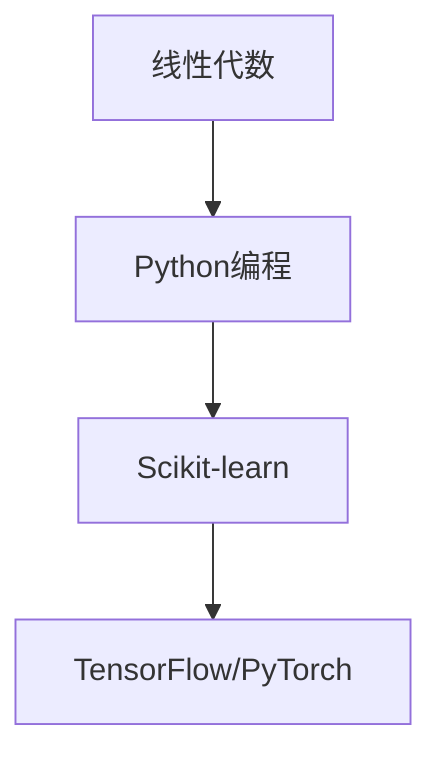

## 什么是机器学习？
机器学习是人工智能的核心领域，通过算法让计算机从数据中自动学习模式并做出预测。

### 核心概念
- **训练数据**：模型学习的素材库
- **特征工程**：数据预处理与特征提取
- **模型评估**：准确率、召回率等指标

## 主要算法类型
1. 监督学习（分类/回归）
2. 无监督学习（聚类/降维）
3. 深度学习（神经网络）

## 学习路径建议

> 推荐资源：吴恩达《机器学习》课程